# Gleipnir — a context-mixing compressor

A from-scratch lossless compressor in one C file. It predicts each bit with 27
statistical models — 30 on raster data — blends their predictions with a learned
mixer, and codes the result with an arithmetic coder.

> **Using it as an archiver?** See **[USAGE.md](USAGE.md)**. `gleipnir.c` wraps the
> engine documented here in a real archive format — directories, per-segment and
> per-member checksums, cheap integrity scrubbing, recovery records, and
> deduplication — and is the thing to point at data you intend to keep. This
> file is about how the compressor works and how it measures up.

```
                      total       ratio     bpc     comp     decomp          peak
gleipnir -9           35,582,296       5.96x   1.343     597s       672s       1055 MB
gleipnir -7           36,493,092       5.81x   1.377     451s       467s        922 MB
gleipnir -5           38,273,415       5.54x   1.445     337s       342s        483 MB
zpaq -m5         39,113,069       5.42x   1.476     559s       582s      839 MB *
gleipnir -3           39,510,297       5.36x   1.491     248s       248s        305 MB
gleipnir -2           40,605,710       5.22x   1.533     187s       188s        234 MB
gleipnir -f2          41,376,463       5.12x   1.562     155s       162s        238 MB
lpaq1 -6         43,006,234       4.93x   1.623     173s       186s      199 MB *
gleipnir -1           43,207,157       4.91x   1.631     139s       139s        196 MB
gleipnir -f1          44,279,445       4.79x   1.671     115s       115s        204 MB
xz -9e           48,456,100       4.37x   1.829     114s         2s      509 MB *
brotli -q11      49,564,563       4.28x   1.871     387s         1s      219 MB *
bzip2 -9         54,506,769       3.89x   2.057      18s        11s       12 MB *
gzip -9          67,631,918       3.13x   2.553      17s         3s        8 MB *
```

Silesia, 211,938,580 bytes, one machine, single thread, every `gleipnir` result
round-trip verified against its SHA-256. `gleipnir` reports its own peak RSS from
inside the process, which is exact; the codecs marked `*` do not, so theirs is
**sampled at 50 ms and is a lower bound** — never compare the two as equals.

The `peak` column is **compression**. Decompression peaks 37–40 MB higher at
every preset (`-9` needs 1095 MB, not 1055), so size a restore host off the
decompression figure — that is the one that has to succeed when it matters.

**Every row above was measured in one session**, interleaved, with `gleipnir -7` and
`zpaq -m5` repeated at both ends as drift sentinels
(`scripts/bench_session.py`, 2 h 25 m). Earlier revisions of this table mixed sessions,
which is not safe here — see below.

**Sizes are exact and reproduce across every session ever run**, including
zpaq's 39,113,069 to the byte. Only the time axis was ever in question.

> ⚠️ **`-7`'s timing is unstable and its speed claim carries a range.** In this
> single run the two `-7` sentinels measured **437.0 s and 464.0 s — a 6.18%
> spread** — while `zpaq -m5` measured 559.4 s both times, a drift of 0.00%.
> The instability is specific to the preset, not the machine. Across sessions
> `-7` has read 404, 437, 462, 464, 486, 490 and 492 s with byte-identical
> output. Its `1.24×` below uses the mean; the range is 1.21–1.28×.
> See [ARCHITECTURE.md §26](ARCHITECTURE.md#26-the-reproducibility-problem).

Two honest summaries, because there is no single one:

- **`-5` beats `zpaq -m5` on all three axes at once**: 2.2% smaller, 1.6× faster,
  and 43% less memory.
- **`-9` buys 9.0% over `zpaq -m5` by spending**: 1.07× the time and 1.26× the
  memory. Two claims here have been withdrawn. An earlier draft of this file
  said `-9` used *less* memory than zpaq; measured head to head that is wrong
  — 1055 MB against 839 MB. It also said 1.31× the time, which was a
  cross-session artefact: measured inside one session `-9` is **1.07× slower**
  (597.1 s against zpaq's 559.4 s). See [Benchmarks](#benchmarks).

That `-9` total ranks **50th of 211 entries** on the [Silesia Open Source
Compression Benchmark](http://mattmahoney.net/dc/silesia.html), ahead of every
zpaq entry on the board. It is **not** state of the art: `paq8px -12L` reaches
27,825,511 — this is +28.6% larger — using 29 GB. See [Where this
stands](#where-this-stands).

All eight presets against all six reference codecs, on one machine and one
corpus. `graphs/speed_vs_size.svg` below is the previous build; these three are
current:

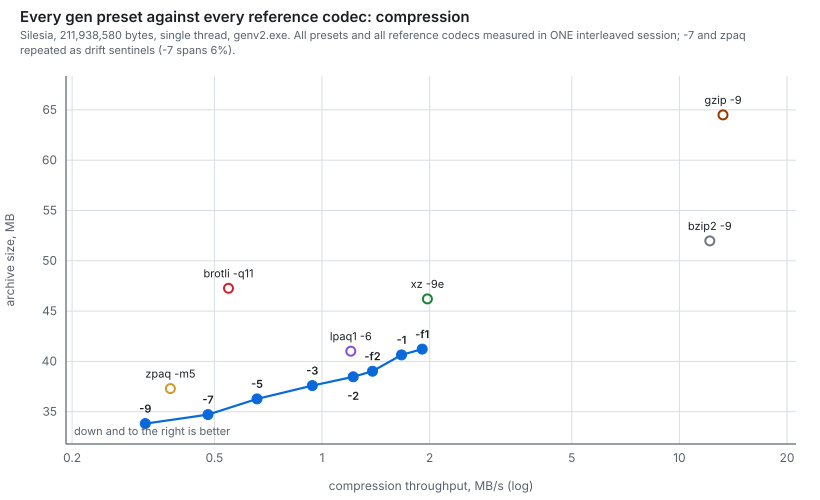
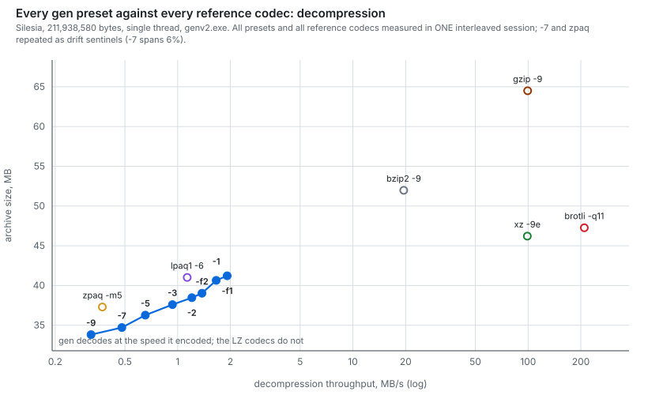
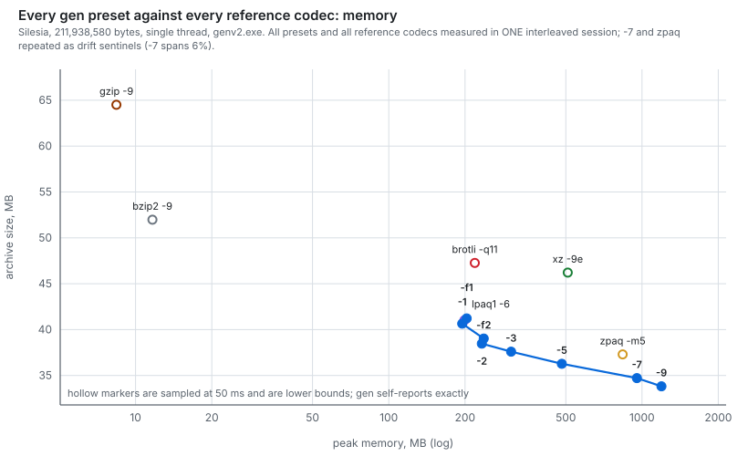

The exchange rate between adjacent rungs — how much extra time each step costs
per 1% of size it saves — is the graph to read before choosing a preset:

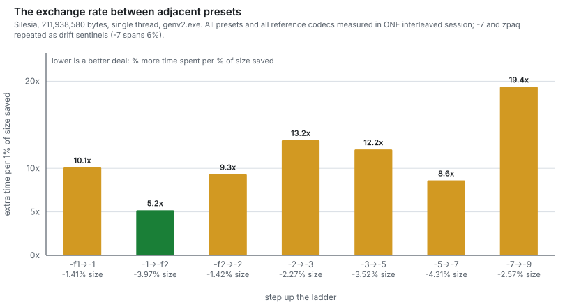

**Decompression needs more memory than compression**, consistently 37–40 MB
more at every preset — 18% at `-f1`, 4% at `-9`, where the model dominates.
The `peak` column in the table above is the *compression* figure, so size a
restore host off this chart rather than off that column:

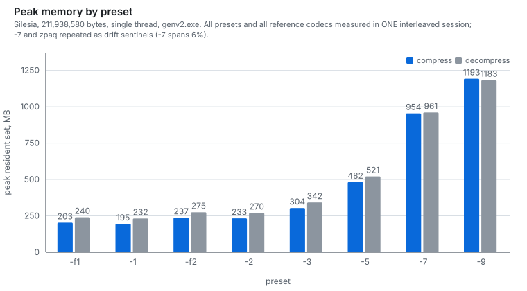

The symmetry that makes this engine unusual is easier to see than to state:
every preset decodes at within a few percent of its encode speed, so the points
sit on the diagonal. `xz` decodes ~50× faster than it encodes and `brotli`
~320×; they would be nowhere near it.

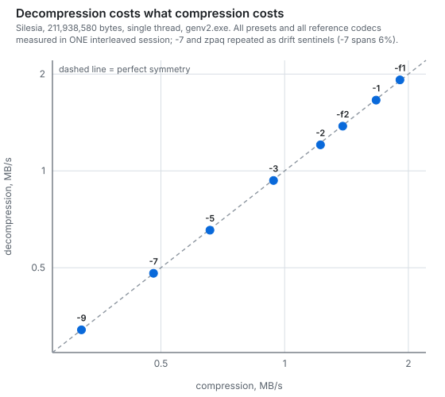

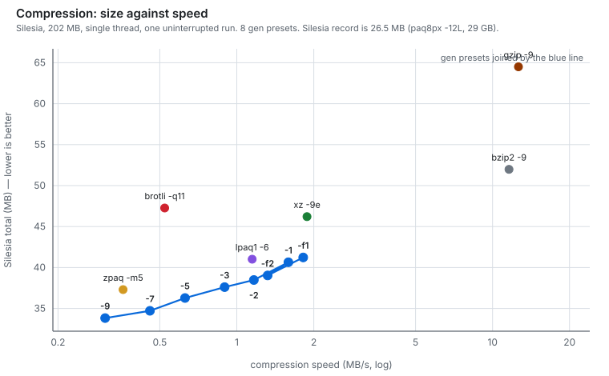

On enwik8 (100 MB of Wikipedia text) it reaches **18,810,676** — 4.2% below
`zpaq -m5`'s 19,625,046 measured on the same machine, but well behind the Large
Text Compression Benchmark leaders, which is where this engine is weakest.
`cmix v21` reaches 14,623,723 at 31 GB, and `durilca'kingsize` reaches
16,209,219 while running roughly 4× *faster* — the case for a text preprocessor.

Six presets span the speed/ratio curve, and **`-7` is within 1.5% of `-9` for
29% less time** — the better default for anything that is not a ratio contest.

---

## Build and use

Prebuilt binaries are on the [releases
page](https://github.com/ValisSowilo/Gleipnir/releases/latest) with a SHA-256 beside
each. Two things to know before taking one:

- The Windows installer is **not code-signed**, so SmartScreen will warn on it.
  `gleipnir.exe` is standalone if you would rather skip the installer -- statically
  linked, KERNEL32 and the UCRT only, so Windows 10 and later need nothing else.
- `gleipnir-linux-x86_64` is the unmodified binary from the CI run for that commit,
  so its hash is checkable against that run. It is dynamically linked and needs
  **glibc 2.38 or newer** -- Ubuntu 24.04, Debian 13, Fedora 39 -- plus
  `libz.so.1`. On anything older it will not start, and there is no fallback
  build. Compile it instead; that takes seconds.

Building from source is the supported path either way.

Linux, against the system zlib:

```bash
apt install build-essential zlib1g-dev   # or the dnf/pacman equivalent
make
make test
```

Windows, under MSYS2/MinGW-w64. zlib is not vendored here, so fetch and build
it once first — `build.sh` links `libz.a` statically and tells you this if it
is missing:

```bash
curl -LO https://zlib.net/zlib-1.3.1.tar.gz
mkdir -p tools && tar xf zlib-1.3.1.tar.gz -C tools
cd tools/zlib-1.3.1 && ./configure && make && cd ../..
sh build.sh
```

Both use `-march=x86-64-v2`, not `-march=native`: a native build dies with an
illegal instruction on any older CPU, which is a miserable way to find out.
Pass `make ARCH=-march=native` if you only care about the machine you are on,
but never hand that binary to anyone.

zlib is linked only for DEFLATE recompression — it must re-deflate byte-exactly,
so it has to be the same implementation. On Windows `-lpsapi` is picked up for
the peak-RSS report; POSIX uses `getrusage` instead.

**`-O3 -funroll-loops` is worth 4.3% over `-O2`, with byte-identical output.**
Plain `-O3` alone is *slower* than `-O2` here (55.2s vs 53.8s on dickens); the
unrolling is what pays. `-ffast-math` is pointless — there is no floating point
in the bit path, only in one-off detection.

```
usage: gleipnir c [opts] archive path...   compress files or directories
       gleipnir x [opts] archive [dir] [member...]
                                      extract (into dir, default .)
                                      d and e do the same thing
       gleipnir t [opts] archive           check integrity
       gleipnir l [opts] archive           list contents
       gleipnir r archive out.gl          rebuild damaged segments

  -1..-9    preset, -1 fastest .. -9 smallest (default 5)
            -1  4 ctx  no SSE      -2  6 ctx  1 SSE
            -3  8 ctx  2 SSE       -5 12 ctx  3 SSE
            -7 19 ctx  4 SSE       -9 27 ctx  6 SSE (30 on rasters)
  -f1/-f2   throughput presets below -1
  -mN       resize every context table by 2^N (-m-1 halves them)
  -tN       worker threads, -t0 = all cores (default 1)
  -sN       segment size in MB (default 64)
  -pN       recovery records: one parity block per N segments
  -D        with t, decode everything and check SHA-256 as well
  -L / -M   with l, print SHA-256 per member / a sha256sum manifest
  -x GLOB   exclude paths matching GLOB.  Repeatable.
  -q        quiet
```

`gleipnir --help` has the full text; [USAGE.md](USAGE.md) has the reasoning behind
each option and the cold-storage recipes.

The preset, memory shift, detected period and chunk count are all stored in the
container, so a file compressed at any setting decodes without being told which,
and decodes correctly at **any** `-t` regardless of what it was encoded with.

Each run reports its own peak resident set:

```
gleipnir -9: 1 file, 10192446 -> 2048642  1.608 bpc  46.0s  0.22 MB/s  846 MB peak  [1 segment]
```

---

## The pipeline

```
input
  │
  ├─ small-alphabet packing        ≤16 distinct bytes → 1/2/4 bits per symbol
  ├─ DEFLATE recompression         embedded zlib/gzip/zip streams → plaintext
  │
  ├─ segmentation                  8 KB windows → model / x86 / Alpha / store
  │     ├─ x86 blocks   → E8/E9 filter
  │     └─ Alpha blocks → instruction byte-swap
  │
  └─ per bit:
        4-30 context models → bit histories → StateMaps → stretch
        (27 at -9, 30 with a detected period)
                │
                ├─ ISSE chain (11 stages, refines low order with high)
                ├─ match model (learned confidence)
                └─ mixer (65,536 weight sets, 32 or 40 inputs)
                        │
                  0-6 SSE/APM stages, by preset
                        │
                  arithmetic coder → output
```

---

## The math

### Probability domain

Everything works in two domains and converts between them with lookup tables.

- **Probability**, 12-bit: `p ∈ [1, 4095]`, meaning `P(bit = 1) = p / 4096`.
- **Stretched** (logit), `d ∈ [-2047, 2047]`:

```
squash(d)  = 4096 / (1 + exp(-d / 256))        the logistic function
stretch(p) = squash⁻¹(p)                        built by inverting the table
```

Mixing happens in the stretched domain because that is where evidence adds
linearly: two independent models that each say "probably 1" should reinforce
each other, and a weighted sum of log-odds does that, whereas a weighted sum of
probabilities cannot exceed its largest input. `stretch` also gives unbounded
confidence room near 0 and 1, where the bits are cheap and precision matters.

### Arithmetic coder

A carryless binary coder over a 32-bit interval `[x1, x2]`:

```
xmid = x1 + ((x2 - x1) >> 12) * p
bit 1 → x2 = xmid
bit 0 → x1 = xmid + 1
while top bytes of x1 and x2 agree: emit that byte, shift both left
```

Cost of a bit is `-log2(P(bit))`, so the entire job of everything upstream is to
make `p` close to the truth. Because the interval only ever narrows and the
shared prefix is emitted immediately, no carry propagation is needed.

### Bit-history states

Each context stores one byte per bit position: a state encoding an
`(n0, n1)` count pair. On bit `y` the matching count increments and the opposite
count is **discounted**:

```
y = 1:  n1 = min(n1 + 1, MAXN);  if n0 > 2: n0 = (n0 + 1) / 2
y = 0:  n0 = min(n0 + 1, MAXN);  if n1 > 2: n1 = (n1 + 1) / 2
```

The discount is what makes this *nonstationary*: a context whose behaviour just
changed adapts in a bit or two instead of waiting out its accumulated history.

The reachable pairs are **enumerated and indexed**, not bit-packed, and bounded
asymmetrically: one count may run to `MAXN = 27` while the other is held to
`MINB = 4`. Packing as `(n0<<4)|n1` spends all 256 states on a square grid
capped at 15 each, so every strongly skewed context collapses into one corner —
and real contexts are extremely skewed ("th" is followed by "e" thousands of
times running). The asymmetric bound spends the same 256 states on the shape
contexts actually take. State 0 is deliberately `(0,0)`: a zeroed table must
mean "nothing seen here yet".

Adding last-bit recency for low counts was tried and measured as noise
(−0.007%); the ISSE chain already conditions richly enough.

### StateMap

A state is not a probability — it has to be *learned* what each history means.
Per model, a 256-entry table maps state → probability, stored as 22 bits of
probability and 10 bits of observation count:

```
p += (target - p) * rate(n),   rate(n) = 1 / (n + 2),  n capped at 255
```

The count-derived rate is a running average that converges fast when a state is
new and becomes stable once it is established — the same idea as a Bayesian
posterior tightening with evidence. 1 KB per model, so it never leaves L1.

### Hash tables

Contexts are hashed into tables of 16-byte **groups**:

```
struct Group { uint8_t chk; uint8_t s[15]; }
```

One group holds an 8-bit check plus the 15 bit-history states of one nibble
(the partial-nibble tree has 15 nodes). Hashing once per nibble instead of once
per bit means **one cache line serves four bits** — this was worth more than any
modelling change in the project's history (144 → 18 cache lines per byte).

Four groups share a 64-byte line, so all four are probed for the check byte at
the cost of one line. That buys a replacement policy: on a miss, evict the
**least established** group in the line, scored by `n0 + n1` of its first state.
With a 41 MB file against 2^20 slots nearly every lookup collides, and blindly
overwriting a context with real history to make room for a one-off is where an
overloaded table bleeds most of its ratio (worth −1.4% on webster). Eight-way
buckets were tried and are worse — a second cache line for nothing.

### Mixer

A single-layer logistic mixer with int16 weights in 16.16 fixed point:

```
d = (Σ wᵢ · stretch(pᵢ)) >> 16          clamped to ±2047
p = squash(d)
wᵢ += (((y << 12) - p) · stretch(pᵢ)) >> 13
```

That update is gradient descent on coding cost: for logistic mixing the
derivative of `-log P(y)` with respect to `wᵢ` is exactly
`-(y - p) · stretchᵢ`, so the learning rule is the error times the input, with
no derivative term to compute. `LRSH = 13` sets the step size and is a sharp
optimum — 12 and 14 are both ~2% worse, re-verified after the input count
doubled.

int16 weights let one SSE `pmaddwd` fold eight products, and more importantly
remove both float↔int conversions from the per-bit dependency chain.

**Weight-set selection** is where a single layer gets its power. The mixer keeps
65,536 independent weight sets, selected by:

| bits | source |
|---|---|
| 0–7 | `c0` — the partial byte, which also encodes bit position |
| 8 | match model active |
| 9 | inside an x86 block |
| 10–13 | previous-byte character class + whether the one before was alphanumeric |
| 14–15 | position within the instruction (fixed-length code only) |

Each selector separates situations that want genuinely different blends: after a
letter vs. in whitespace vs. inside markup; an opcode byte vs. a displacement
byte. Because non-code blocks always have instruction-position 0, three quarters
of the table is never touched on ordinary files — the extra rows cost them
nothing.

A **two-layer mixer was tried and rejected** (+0.48%): with 65,536
context-selected weight sets the single layer already has the specialisation a
second one would add, and a second mixer with a weaker selector only adds noise.
Training layer 1 on the final post-SSE error was much worse still (+4.53%).

### ISSE chain

This is the structural difference between this compressor and a plain
lpaq-style one, and it is worth **−2.07% on the corpus**.

A flat mixer makes every order compete: each hands over one stretched number, so
"order-6 seen twice, both 1" and "seen forty times, all 1" arrive identical —
the confidence was already folded away by the StateMap. An **Indirect Secondary
Symbol Estimation** chain instead lets each higher order *refine* what the lower
orders already decided:

```
p₀ = stretch(order-1 prediction)
for each stage k:
    s = bit-history state of context k          ← selects the weights
    w = IW[k][s]                                 ← two int32 weights
    pₖ = clamp2047((w₀ · pₖ₋₁ + w₁ · 512) >> 16)
```

The weights are indexed by the refining context's **bit-history state**, so how
much to move the estimate is learned per confidence level: a rarely-seen context
learns to barely nudge it, a well-established one learns to override it. Each
stage starts as the identity (`w₀ = 65536, w₁ = 0`) and has to earn its way.

Each stage trains on **its own** error, not a backpropagated one — it is only
ever asked to be a better estimate than the stage below it, which is the job it
was given:

```
e = (y << 12) - squash(pₖ)
w₀ += (e · pₖ₋₁) >> 12
w₁ += e >> 3
```

Everything stays in the stretched domain and only the final value is squashed,
so 11 stages cost 11 multiply-adds, not 11 mixers. Three taps along the chain
(⅓, ⅔, end) feed the mixer, riding in lanes it was already multiplying by zero.

Chain order: orders 2→3→4→5→6→7→8→12→16, then word, word-pair. Adding the
structural contexts beyond that makes it worse — they are a different axis, not
increasing specificity of the same sequence.

**Length is 11, not 15, and that is a speed decision.** The chain is inherently
serial: each stage's input is the previous stage's output, so its cost is
latency, not throughput. Stages 12–15 refine an estimate the first eleven have
already converged on. Measured 15 → 11: dickens +0.022%, mr +0.009%, samba
+0.035% in size, for 4.8 / 6.1 / 9.1% less time. Cutting to 9 starts to cost
real ratio (+0.114% on dickens) for little further gain.

### SSE / APM stages

Up to six adaptive probability maps refine the mixer output **in series** — each
stage corrects its predecessor. Each holds 33 interpolation buckets per context
along the stretched axis:

```
i = (stretch(p) + 2048) >> 7          bucket, with the low 7 bits as weight
q = (t[i]·(128-w) + t[i+1]·w) >> 11   linear interpolation
p = (q·2 + p·2) >> 2                  blend half refined, half direct
t[i] += (target - t[i]) >> 8          rate APMR = 8
```

An APM learns a *correction curve*: "when the mixer says 0.9 in this context, it
is really 0.85." Interpolating between buckets means neighbouring confidences
share evidence. The blend keeps half the original estimate so a cold APM cannot
do damage. Contexts used, in order:

1. `c0` — partial byte
2. previous byte + `c0`
3. match-length bucket + `c0` — how long the match has held is the strongest
   single signal for pulling toward certainty
4. hashed previous two bytes + `c0`
5. line position + in-tag + word case + `c0`
6. hashed current word + `c0`

Stages 5 and 6 are text-specific. On mr, **four stages are both smaller and
faster than six** (−0.202% size, −7.0% time), which is why the stage count is
part of the preset rather than fixed.

**Only the stages a preset evaluates are allocated.** This was a real bug, not
a tuning knob, and it was found by disbelieving a null result: shrinking the a4
and a6 tables produced *byte-identical* output at `-5` and `-3`, which is
impossible if those stages are running. They were not — `NAPM` is 3 and 2 there
— but every stage was allocated regardless. At `-1`, where `NAPM` is 0, that was
**43 MB of tables allocated and never read**, multiplied by thread count since
each worker allocates its own. Fixing it cut peak RSS by 52% at `-1`, 35% at
`-2`, 20% at `-3` and 10% at `-5`, with provably identical output, and cut time
8–17% because the allocator no longer touches pages nothing will ever read.

**Hash width of a4 and a6 is per preset.** At 10 bits the pair is 33 MB and
every bit lands on a scattered row, so they never cache — and the cost of that
grows with file size, because they compete with the context tables for L3:

| a4/a6 hash | pair size | dickens (10 MB) | webster (41 MB) | mr (10 MB) |
|---|---|---|---|---|
| 10 bits | 33.0 MB | — | — | — |
| 8 bits | 8.2 MB | −3.4% time, +0.061% | −0.6%, +0.107% | −1.2%, +0.030% |
| 4 bits | 0.5 MB | −12.3% time, +0.384% | **−21.7%**, +0.498% | −4.1%, +0.102% |

A poor trade at `-9`, whose whole job is the smallest output, so it keeps 10
bits. A good one at `-7`, which takes 6 bits for −8.6% time at +0.12% size.
Below that the stages are not evaluated at all and the width is moot.

**Parallel SSE stages were tried and rejected.** The six stages are the only
place in the bit path with six *dependent* random loads back to back, two of them
into 17 MB tables — so evaluating all six against the mixer output instead, and
blending them with a small learned mixer, should have collapsed six memory
latencies into roughly one. It does not pay:

| arrangement | dickens size | dickens time |
|---|---|---|
| serial 6 (shipped) | — | — |
| **parallel 6 + learned blend** | **+4.072%** | **−10.6%** |
| serial 4 | +0.215% | −12.4% |
| serial 2 | +0.546% | −24.0% |
| serial 0 | +0.854% | −31.4% |

Simply using fewer serial stages dominates it on both axes — serial-2 gives
half the ratio loss for more than twice the time saving. The refinement *is* the
mechanism: each stage is trained to correct the one before it, and independent
stages blended after the fact are estimating the same thing six times instead of
successively sharpening it. The dependency chain is the price of the method, and
the whole chain is only 31% of runtime, so there was less to win than the
structure suggested.

Rate 8 and a half-and-half blend were found by sweep and are worth −0.24% over
the original rate 7 / three-quarters blend — which turned into **−2.4% on full
webster**, a good example of why slices mislead (below).

### Skipping stages that cannot change the answer

Since the chain is serial and 31% of runtime, the useful question is not how to
parallelise it — that was tried and lost (above) — but when to stop early. At
`-9` the last four stages run only while the estimate is still in doubt:

```c
if (SSEGATE && k >= SSEK) {                 /* first two always run */
    int s = stretch_t[p];
    if ((s < 0 ? -s : s) >= SSEGATE) break; /* already confident: stop */
}
```

The gate reads `p`, which the decoder has computed identically from the same
model, so both sides stop at the same stage — that symmetry is the only thing
making it legal. `update` then trains exactly the stages that predicted, since a
skipped stage still holds the table index it used on an earlier bit.

**+0.014% size for −14.6% time at `-9`** (gate 1024), and −7.3% for +0.086% at
`-7` (gate 768). Two related gates ship alongside it: the ISSE chain leaves early
once its running estimate is railed (+0.030% for −3.7% at `-9`), and mixer/ISSE
training is skipped on bits where `|err|` is under 16 — which was expected to
save time and instead **improves ratio at every preset**, by 0.215% at `-1`
rising to 0.702% at `-9`. Full derivations, sweeps and the reasoning about
symmetry are in
[ARCHITECTURE.md §13](ARCHITECTURE.md#13-three-gates-on-work-that-cannot-change-the-answer).

---

## The models

Level 9 runs 27 context models, or **30 on data with a detected row/record
period** — the three raster models exist only when there is a period for them to
read, because carrying them on text and zeroing their inputs costs time for
byte-identical output. Each model is a hash of some view of the history; the
table below gives what it sees and what it is good at.

| # | context | what it captures | strong on |
|---|---|---|---|
| 1–10 | **byte orders** 1,2,3,4,5,6,7,8,12,16 | the last N bytes verbatim | everything; the backbone |
| 11 | **word** | case-folded alphanumeric run | prose, source, markup |
| 12 | **word pair** | current + previous word | prose grammar |
| 13 | **word triple** | current + 2 previous words | prose grammar |
| 14 | **word shape** | case pattern, word length, prev 2 bytes | capitalisation, headwords |
| 15 | **line/markup** | column since newline, inside `<…>` | wrapped text, HTML, XML |
| 16 | **above + column** | byte at same column of previous line | line-oriented records |
| 17 | **above + left** | byte above and byte before | tables, database dumps |
| 18–19 | **sparse** (−2,−4) and (−1,−3,−5) | strided byte pairs/triples | binary records, 16-bit data |
| 20 | **record: above + column** | byte one stride back + column | images, star catalogues |
| 21 | **record: above + left** | byte one stride back + byte before | fixed-width records |
| 22–23 | **indirect** order-1, order-2 | *what followed this context last time* | alternating vs. repeating runs |
| 24 | **distance** | log₂ bytes since this byte value last appeared | periodic data, field boundaries |
| 25 | **nesting** | bracket depth + quote state | source code, markup, JSON |
| 26–27 | **sparse** (−1,−3) and (−1,−4) | skip-one and skip-two pairs | binary, interleaved data |
| 28 | **MED predictor** | gradient-adjusted estimate W+N−NW, clamped, + plane | 16-bit images |
| 29 | **N, W, NW joint** | the three neighbours as one context | rasters, fixed records |
| 30 | **gradient class** | quantised W−NW, N−NW, W−N + plane | smooth image regions |

Models 28–30 are present only when `detect_period` found a period; 20–21 are
silenced (fed as zero) in the same case.

> The newest parts of the engine — period detection, the three raster models,
> the Alpha detection gates and the per-preset SSE staging — are derived in full,
> with the mathematics and the source, in **[ARCHITECTURE.md](ARCHITECTURE.md)**.
> This section is the summary; that document is the working.

### Notes on the interesting ones

**Byte orders past 8.** `hist` is a 64-bit register holding the last eight
bytes, so orders 12 and 16 are hashed off the ring buffer instead. Those bytes
sit immediately behind the write pointer and are always in L1, so it stays
cheap.

**Word contexts are case-folded.** Left case-sensitive, "The" and "the" are
separate contexts that each learn English from scratch — half the evidence
behind every word context for no gain. Case is far better predicted from a
handful of shape bits (model 14) than by duplicating the whole vocabulary. Raw
case remains fully visible to the byte orders.

**Line and markup position** was the single biggest win on webster (−2.0%).
When a line is 72 characters long nothing in the last 16 bytes says so, and no
byte-order context can see a wrap coming. Silesia's webster is HTML-marked-up
text, hard-wrapped at 70–76 columns, with `<` and `>` appearing 309,146 and
309,150 times in the first 4 MB — two kinds of structure every order was blind
to.

**Previous-line contexts** are the record model's idea applied to
newline-delimited rows instead of a fixed stride. Worth **−10.8% on nci** (a
chemical database of fixed-format lines) and −3.6% on samba.

**Record model stride discovery — measured, not voted.** The stride used to be
found by voting: each 2-byte context remembered where it last occurred and the
gap was a vote. Checked against the corpus, that detector was wrong on every
file it mattered for:

| file | it settled on | the real period | |
|---|---|---|---|
| x-ray | 56 | **2**-byte samples, **3800**-byte rows | mad 21.0 vs 132.9 at stride 1 |
| mr | 4 / 6, thrashing | **1024** | mad 7.2 vs 60.8 — the strongest signal in the corpus |
| sao | 56 | **28** | 7,251,944 = 28 × 258,998 exactly |
| osdb | 998 | none | no stride beats looking one byte back |
| ooffice | 78, **18,944 changes** | none | pure thrash |

Three separate failures. It picked **harmonics**, because every multiple of a
period recurs exactly as reliably as the period — sao's minima at 28, 56, 84,
112, 140, 196, 252 are all within 2% of each other. It had no way to report
*no period*, so on osdb and ooffice two of the 27 contexts modelled noise for
the whole file. And each change of mind reset the column phase, discarding the
statistics accumulated so far.

What the record contexts actually ask is "is the byte one stride back a good
predictor of this one". **Mean absolute difference answers exactly that
question**, so the stride is now measured directly:

1. Coarse pass: mean |d[i] − d[i−s]| for every s in 1…8192, over two 32 KB
   windows spread through the buffer.
2. Element width: the smallest s ≤ 4 whose MAD is ≤ 0.6× MAD at stride 1. This
   is what makes x-ray 16-bit and leaves sao byte-oriented.
3. Row/record: the best s ≥ 8, then walk *down* to the smallest s within 3% of
   it — the harmonic reduction that turns sao's 56 back into 28.
4. Confirm on four 256 KB windows, and **reject unless MAD(s) ≤ 0.85 × MAD(1)**.
   That gate is what lets osdb and ooffice report no period.

It runs once, on the encoder, over the whole buffer, and the answer is carried
in the header — so both sides start from the same stride, the phase never
re-anchors, and the per-byte cost is *negative*: removing the vote removed a
random 256 KB table access from every byte.

**Element width is why 16-bit images were being modelled badly.** In 16-bit
raster data the byte at −1 is the other half of the current sample and predicts
almost nothing; the byte at −2 is the same plane of the previous sample. The
"above + left" context now steps back one *element*, not one byte, and the
raster models carry a plane bit, because the high byte of a medical image is
smooth while the low byte is nearly noise — sharing one set of statistics blunts
both.

**Indirect models** ask a different question from every other model. An order-N
context asks "what usually comes next"; an indirect context asks "what came next
the last time or two", which separates a context that alternates from one that
repeats even when their aggregate statistics are identical. One byte of
follow-history is optimal — four bytes makes the context nearly unique and it
becomes noise.

**Match model** (not in the table; it feeds the mixer directly). A 4M-entry
index maps an order-6 hash to the most recent position with that context. On a
hit it verifies backwards up to 60 bytes to get an initial length, then extends
one byte at a time while it keeps predicting correctly. Its vote is not a fixed
confidence but a **learned** one: a count-adaptive StateMap indexed by
(length bucket, predicted bit, bit position within the byte). Position matters
because the high bits of a predicted byte are nearly free while the low ones are
where a match breaks. A larger index measured worth only −0.08% and is not worth
the memory; a second match model at another order was also rejected.

**Match bypass — the model declining to run.** When the match has held for
`BYPT` bytes running, the full model is being paid to confirm what the match
already knows: the bit costs about 0.01 bits to code and 27 group probes, 30
StateMap loads, the ISSE chain, the mixer and up to six serial APM stages to
predict. Inside such a run the byte is coded through the match StateMap alone —
still adaptive, one L1 load per bit — then absorbed exactly like a stored byte,
so the match model, record phase and word state stay coherent. The gate reads
only `mlen` and `mptr`, which both sides maintain identically, so the decision
never has to be signalled.

At a high enough gate this is **smaller as well as faster**, which is not what a
speed shortcut usually does. At the top length bucket the match StateMap commits
harder than the mixer blend can: the mixer is hedging across 27 opinions, most
far less certain than the match, and inside a long match hedging is a cost
rather than insurance. Gates are 96 (`-1`/`-3`/`-5`), 128 (`-7`), 400 (`-9`);
`-DBYT=n` overrides and 0 disables.

**The gate must be swept on files that disagree.** It originally shipped at 48
for `-1`/`-3`, chosen on samba alone. On the full corpus that costs **+14.28% on
nci and +5.63% on xml** at `-1`, and +22.40% / +8.55% at `-3` — both are almost
entirely medium-length matches, where the full model still contributes a great
deal. At 96 the same mechanism is a *ratio win*: −0.263% size and −7.0% time at
`-1`, with no file worse than +0.23%. See [ARCHITECTURE.md](ARCHITECTURE.md) for
the sweep.

**Active-context list.** When no period is detected the record contexts are
constants. They used to be *silenced* — their mixer input zeroed after being
computed — which paid a hash, a prefetch, a bucket probe, a StateMap load and
two updates per byte to produce a number that was then discarded. They are now
skipped entirely, and their tables are not allocated. The stride is known before
`set_level` on both sides, so the skip list is static and the two sides cannot
disagree. Output is byte-identical; the cost is not: **−7.4% time on dickens
`-9` and −32 MB per thread**.

---

## Transforms

Applied before modelling, undone after decoding. Each must be **exactly**
reversible, which is harder than it looks.

### Small-alphabet packing

If a file uses ≤16 distinct byte values, symbols are packed 1, 2 or 4 to the
byte. A file of ASCII `'0'`/`'1'` characters carries one bit of payload per
eight bits of storage; packing hands the model the actual information density.
On a 23 MB file of ASCII bits this reaches 8:1 in 0.20 s where brotli needs 66 s.

### DEFLATE recompression

Embedded zlib, gzip and ZIP streams are inflated, the *plaintext* is modelled,
and the stream is rebuilt on decode. DEFLATE is not canonical — the same
plaintext has many valid encodings — so the encoder searches a table of
(level, memLevel, strategy) combinations and **verifies the rebuild is
byte-identical** before accepting. Streams that cannot be reproduced are left
alone. Roughly 99% of real-world streams are matched. Worth −7.9% on mozilla
(a tar containing JAR archives).

Candidates inside detected code regions are declined: a bare zlib header is two
bytes with a five-bit check, so inside tens of megabytes of machine code plenty
of positions pass it by chance.

### E8/E9 x86 filter

Relative `CALL`/`JMP` operands encode the *distance* to their target, so two
calls to the same function look completely different as byte strings. Rewriting
them as absolute addresses makes them identical.

Reversibility needs two things, and getting them wrong is subtle:

1. **A predicate the transform cannot disturb.** The opcode `d[i]` and the
   operand's high byte `d[i+4]` are tested and only the low 24 bits between them
   are rewritten, so a position's eligibility reads the same before and after.
   Testing the operand value does not work — the encoder would be asking about a
   relative address while the decoder asks about an absolute one, and at the
   16 MB boundary those disagree.
2. **Matching scan order.** An operand overlaps the windows of positions just
   below it, so both passes must observe those bytes in the same state. Encoding
   backwards and decoding forwards achieves exactly that: at position `i` both
   passes see every transform above `i` applied and every one below it not.

### DEC Alpha instruction byte-swap

Silesia's mozilla is the Tru64 UNIX build — 134 Alpha COFF binaries,
45,178,880 bytes, **88% of the file**. There is no x86 in it.

Alpha is fixed-length 32-bit RISC and **little-endian**, so the opcode (bits
31–26, the field that determines everything else) lands in the *last* byte of
each instruction. A context model reads left to right, so it was being asked to
predict registers and displacements before seeing the opcode governing them.
Reversing the bytes of each instruction puts the opcode first. The operation is
its own inverse and fixed-length words cannot overlap, so unlike E8/E9 there is
no scan-order hazard. Worth **−5.7% on mozilla** on its own.

An Alpha branch transform (relative → absolute displacement, the E8/E9 idea) was
tried and is **worse** (+1.5% at best): Alpha procedure calls go through
register-indirect `JSR`, so `BSR` displacements do not repeat, and converting
them just makes local branches unique.

---

## Content detection

The input is classified in 8 KB windows into four block kinds. The kind and, for
code, the instruction alignment are packed into one byte per block:

```
bits 0–1  kind: model / x86 / store / Alpha
bits 2–3  instruction alignment within the chunk
```

**Store** — order-0 entropy above 7.98 bits. Already-compressed data is copied
verbatim, but still fed through the history so the match and record models can
match against it later. The threshold has to be brutal: 7.90 makes mozilla 2.7%
*worse*, because the match model was still finding real repeats across DEFLATE
members.

**x86** — E8/E9 call density above roughly 14 per 8 KB together with entropy
above 5.0. Inside a file already known to be an executable, everything
non-random is filtered.

**Alpha** — the interesting one. An absolute score does not work: the fraction
of 4-byte-aligned words whose top six bits are a valid Alpha opcode is 0.93 for
nci, which is ASCII. The signature is **alignment asymmetry** — in genuine
fixed-length code that fraction is high at one alignment and near-uniform at the
other three. Requiring the best alignment to beat the runner-up by 0.12, with an
absolute floor of 0.45, gives zero false positives across all twelve Silesia
files while catching the code.

Zero false positives *on Silesia*, which turned out to be the catch. The test
reads only the top six bits of every fourth byte, so **any format with a
near-constant byte at one alignment scores ~1.0 there and low elsewhere** —
which is precisely the signature it is looking for. An array of monotonically
increasing 32-bit integers does exactly this: the high byte barely changes, and
if that value lands in the opcode mask the whole run reads as perfectly aligned
code. Measured on a 4 MB `int32` array, it byte-swapped 1,096 KB and cost
**2.67%**. Silesia contains no such file, so nothing revealed it until a
mixed-type corpus was built.

The discriminator is **opcode diversity**, chosen from measured distributions
rather than guessed:

| | distinct opcodes at winning alignment | share held by the top opcode |
|---|---|---|
| mozilla (real Alpha) | 0% of windows ≤8, 1% ≤12 | 11% ≥40%, **0% ≥60%** |
| int32 array (false positive) | **100% ≤4** | **100% ≥100%** |

So: reject unless there are at least 8 distinct opcodes and no single opcode
holds 60% or more. That rejects the integer array completely and mozilla not at
all. The first attempt at this used ≥12 distinct and ≤40% share, which looked
reasonable and **regressed mozilla by 0.37%** by rejecting 11% of its genuine
Alpha windows — the thresholds have to come from the distributions, not from
intuition about what "diverse" means.

Two window types still pass that arguably should not: IEEE double arrays and
TrueType glyph data both have genuinely high opcode diversity and are not
separable this way. Their Alpha volume is small (24–40 KB of a 4 MB file) and
costs 0.1–0.2%.

**Alpha is not tested at all inside a PE or ELF image.** After the diversity
gate, a 3.6 MB x86-64 DLL was *still* claiming 136 KB of Alpha and losing
**1.19%** — and stealing three windows from the E8/E9 filter that should have
handled them. The fix is structural rather than another threshold: a file
opening with `MZ` or `ELF` is a single-architecture image, and that architecture
is not DEC Alpha. Worth −1.19% on the DLL and **−0.55% on ooffice**, which is
also a DLL and was one of the weakest files against zpaq.

mozilla is deliberately unaffected: it is a tar, so it has no MZ header,
`file_is_exe` is false, and its 479 genuine Alpha blocks are still found.

Three Alpha false positives, then — integer arrays, float arrays and x86-64
binaries — and **Silesia could not expose any of them**. That is the argument
for the mixed corpus, not the individual percentages.

Those thresholds had to be re-tuned once the transform actually worked: while a
macro collision (below) was silently suppressing it, false positives were free,
and looser thresholds looked better. With the transform live, loose settings
cost sao +2.4% and osdb +12.8%.

**Period and element width** — measured once per stream rather than per window,
since a row length is a property of the whole raster. See the record-model notes
above for the algorithm and for the four ways the previous detector failed.

### Beyond Silesia: a mixed-type corpus

Silesia is two English texts, one Polish text, XML, HTML, a source tarball, two
executables, two medical rasters, a star catalogue and a database dump. It has
no JSON, no CSV, no logs, no float or integer arrays, no UTF-16, no base64, no
already-compressed input, no audio, no genomic data and no 64-bit code — and
tuning only against it is how a detector that byte-swaps integer arrays survives
for months.

`scripts/make_mixed.py` generates a 13-file corpus covering those gaps (synthetic files
use a fixed seed; the DLL, font and Python sources are real). `scripts/bench_mixed.py`
runs it against zpaq, xz and lpaq1. Results at `-9`, all round-trip verified:

Margins below are against the **best** of zpaq/xz/lpaq1 on that file, not against
zpaq alone:

| file | gleipnir -9 | bpc | best | margin |
|---|---|---|---|---|
| `precomp.zlib` | 713,000 | 4.106 | **gleipnir** | −48.67%; DEFLATE recompression unpacks it |
| `x64.dll` | 807,740 | 1.789 | **gleipnir** | −10.02%; E8/E9 works on x86-64 |
| `csv.txt` | 1,096,636 | 2.092 | **gleipnir** | −6.24% |
| `python.src` | 580,606 | 1.107 | **gleipnir** | −5.00% |
| `dna.fasta` | 1,035,296 | 1.975 | **gleipnir** | −1.59%; alphabet is 19 chars, so packing declines |
| `json.txt` | 238,222 | 0.454 | **gleipnir** | −1.51% |
| `font.ttf` | 1,045,966 | 3.328 | **gleipnir** | −0.41% |
| `pcm16.bin` | 2,285,501 | 4.359 | **gleipnir** | −0.36%; stride 4 found |
| `log.txt` | 474,828 | 0.906 | **gleipnir** | −0.19% |
| `base64.txt` | 3,154,964 | 6.018 | lpaq1 | +0.13%; random underneath, all codecs within 0.1% |
| `i32.bin` | 740,932 | 1.413 | zpaq | +0.18% after the Alpha gates, was +2.93% |
| `utf16.txt` | 151,856 | 0.290 | lpaq1 | +0.81%; level with zpaq |
| `f64.bin` | 3,248,873 | 6.197 | zpaq | +0.84% |

**Nine of thirteen go to gleipnir**, and the four losses are worth separating.
`base64.txt` and `utf16.txt` are near-ties — every codec lands within 0.9%, and
base64 within 0.13%, because the payload underneath is random. The two real
losses are both **numeric arrays**, and they are the clearest remaining
modelling gap: `f64.bin` is a smooth signal stored as IEEE doubles, where the
informative structure is in the exponent and high mantissa bytes and the low
mantissa bytes are noise. Nothing here models that split — the raster contexts
treat a sample as bytes, not as a float. A value-aware numeric model is the
obvious next addition.

The Alpha gates are visible in the detector output rather than only in the
sizes: `i32.bin` now reports `period` and `x64.dll` reports `x86`, where both
previously reported `alpha`. That is the false positive being refused, not
merely being outvoted.

### What it recognises, and what it does not

Everything the Silesia corpus actually contains is now identified: English and
Polish prose, HTML and XML markup, source tarballs, x86 and DEC Alpha code,
DEFLATE members, fixed-width record databases (sao 28 bytes, nci 70 bytes), and
16-bit rasters with their row stride and endianness (x-ray 3800/LE, mr 1024/BE).
Files with no exploitable structure — osdb, ooffice — are correctly identified as
having none, which is a real result rather than a gap: it stops models from
being fed noise.

Not detected, because nothing in the corpora needs it: JPEG (would need a full
DCT-coefficient model), audio/WAV, UTF-16 text, base64, and BMP/TIFF headers.
The absent capability that *would* pay on this corpora is not a detector at all
but a **text preprocessor** — a dictionary/word-substitution stage of the kind
`durilca'kingsize` uses to reach 16,209,219 on enwik8, 15% below this compressor
while running about 4× faster.

---

## Threading

`-tN` splits the input into N chunks compressed independently. The chunk count
is stored, so decoding parallelises automatically and an archive decodes
correctly at any `-t`.

All model state lives in a `Ctx` struct passed by pointer, not in globals,
because **neither thread-local mechanism works** on this toolchain: `__thread`
compiles to *emulated* TLS (a function call per access, fatal in a loop that
touches this state millions of times a second), and `__declspec(thread)` is
silently **ignored** — an 8-thread test showed every thread sharing one
variable, which would have produced silent data races and corrupt archives.

Chunks below 1 MB are refused: a small chunk is all cold-start cost and no
parallelism, which is why `-t12` on a 10 MB file quietly uses 9 chunks.

### The cost

Parallelism is paid for twice — in ratio, because each chunk starts with empty
tables, and in **memory, because every worker allocates its own complete model**.
dickens (10.2 MB) at `-9`:

| | output | vs `-t1` | comp | speedup | decomp | peak RSS |
|---|---|---|---|---|---|---|
| `-t1` | 2,051,952 | — | 37.2s | 1.00x | 37.3s | 844 MB |
| `-t2` | 2,109,696 | +2.81% | 21.0s | 1.77x | 20.9s | 1658 MB |
| `-t4` | 2,181,987 | +6.34% | 12.5s | 2.98x | 12.2s | 3273 MB |
| `-t8` | 2,270,053 | +10.63% | 10.5s | 3.55x | 10.5s | 6455 MB |
| `-t16` | 2,286,617 | +11.44% | 10.3s | 3.61x | 10.6s | 7241 MB |

Three things to take from this table.

**Memory is linear in thread count.** `-t8` at `-9` needs **6.5 GB**. This is the
most likely way to be surprised by this engine in a container: `-m` does not
help much because the per-thread model is what is multiplying. Threading and
memory limits interact multiplicatively, not additively.

**Speedup saturates at about 3.6×**, and `-t16` buys nothing over `-t8`
(10.3s vs 10.5s) while costing another 800 MB and 0.8% ratio. Past the physical
core count there is nothing to gain and real ratio to lose.

**`-t2` is the efficient point** — 1.78× for 2.81%, close to linear. `-t4` still
earns its keep at 3.08× for 6.33%. `-t8` and beyond are for wall-clock deadlines
only.

**Pair threading with `-m-2`**: a chunk is a fraction of the file and does not
need full-size tables, so shrinking them costs little ratio while cutting the
per-thread footprint roughly four-fold — which is the multiplier that matters.

```bash
gleipnir c -9 -m-2 -t8 archive.gl input
```

---

## Levels and memory

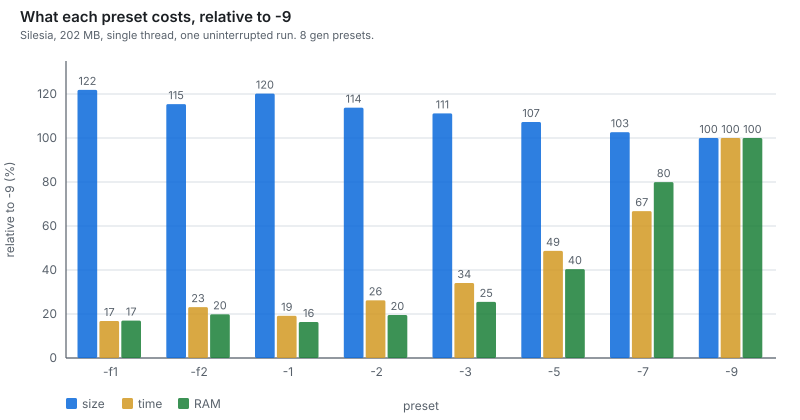

Measured on dickens (10,192,446 bytes), single thread, RSS self-reported:

| preset | contexts | ISSE | SSE | a4/a6 hash | match index | output | time | RSS |
|---|---|---|---|---|---|---|---|---|
| `-1` | 4 (orders 1–4) | 3 | 0 | — | 2^18 | 2,405,461 | 8.1s | 36 MB |
| `-2` | 6 | 4 | 1 | — | 2^19 | 2,231,484 | 11.9s | 75 MB |
| `-3` | 8 | 5 | 2 | — | 2^19 | 2,115,005 | 14.9s | 147 MB |
| `-5` | 12 | 7 | 3 | — | 2^20 | 2,102,092 | 17.7s | 325 MB |
| `-7` | 19 | 9 | 4 | 6 bits | 2^21 | 2,056,647 | 28.9s | 733 MB |
| `-9` | 27 / 30 | 11 | 6 | 10 bits | 2^22 | 2,051,952 | 37.3s | 844 MB |

Each preset is a distinct model configuration — context set, ISSE chain length
and SSE stage count all change together, because they turned out to trade
against each other rather than independently. On this file **`-7` is within
0.23% of `-9` for 22% less time**; across the whole corpus it is +2.40% for 29%
less time, which makes it the better default for anything but a ratio contest.
The gap is smaller on dickens than on the corpus because prose is where the
extra contexts at `-9` have least left to find.

The context sets are chosen, not truncated. `-5` carries orders 1–6 plus word,
word-pair, line, previous-line, indirect and one sparse; it does *not* carry the
record contexts, which are inert unless a period is detected — that mistake is
what made the previous `-5` lose to lpaq1 on both size and speed.

Table sizes are not uniform — the word contexts get 2^23 groups and the mid
byte orders 2^22, while the shape, line and sparse contexts get 2^18 because
their domains are small and the space would be wasted. `-mN` scales all of them
by 2^N, clamped to [2^10, 2^24] per table.

### How memory trades against speed

Swept on dickens at level 9. Memory is computed exactly from the table geometry
(validated against the 877 MB measured for `-m0`); times are single-thread on an
otherwise idle machine.

| `-m` | memory | output | vs `-m0` | time | vs `-m0` |
|---|---|---|---|---|---|
| −7 | 78 MB | 2,229,805 | +8.56% | 47.7s | −8.4% |
| −6 | 84 MB | 2,173,939 | +5.84% | 47.0s | −9.8% |
| −5 | 96 MB | 2,135,531 | +3.97% | 47.3s | −9.2% |
| −4 | 121 MB | 2,107,804 | +2.62% | 45.6s | −12.5% |
| −3 | 171 MB | 2,086,720 | +1.59% | 46.3s | −11.1% |
| −2 | 270 MB | 2,071,044 | +0.83% | 47.6s | −8.6% |
| −1 | 468 MB | 2,060,536 | +0.32% | 49.7s | −4.6% |
| **0** | **864 MB** | **2,053,946** | — | **52.1s** | — |
| +1 | 1656 MB | 2,049,995 | −0.19% | 55.3s | +6.1% |
| +2 | 2473 MB | 2,048,061 | −0.29% | 59.6s | +14.4% |

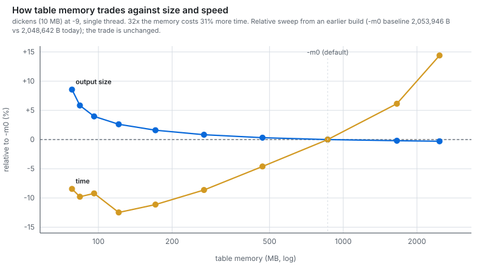

**Memory costs speed through miss latency, not bandwidth — and the prefetch
already hides most of it.** All contexts' group addresses for a nibble are
computed and prefetched together, then their check bytes validated in a second
pass, so the misses overlap into roughly one memory latency instead of one each.
That is why a **32× memory increase costs only 31% more time**.

Time is flat from 78 to 270 MB (the dip at 121 MB is run-to-run noise), then
rises 5–8% per doubling. The marginal trade is the number that matters:

- `-m-4` → `-m0`: 7× the memory, **−2.55%** size, +14.3% time
- `-m0` → `-m2`: 2.9× the memory, **−0.29%** size, +14.4% time

The same time for **9× less benefit**. (`-m2` grows only 1.5× rather than 2×
because the per-table clamp at 2^24 bites.)

This curve is for a **10 MB file**. Larger inputs fill larger tables, so the knee
moves right; do not carry these settings to a 1 GB input without re-sweeping.

---

## Benchmarks

Full Silesia corpus, 211,938,580 bytes, single thread, one preset per row.
Compression and decompression both measured, RSS reported by the engine itself,
every row round-trip verified against its SHA-256 — a failed verify invalidates
the row, not just its timing.

Times come from a **single interleaved session** (`scripts/bench_session.py`, 2 h 25 m),
with `gleipnir -7` and `zpaq -m5` repeated at both ends as drift sentinels. `gleipnir`
archives the whole directory; reference codecs run per file and are summed,
which is the published protocol kept unchanged so these numbers stay comparable
to the ones they replace.

`-7` carries an explicit ±6%: its two sentinel readings in this run were
437.0 s and 464.0 s, where `zpaq` read 559.4 s both times.

**The protocol this replaces was wrong, and the error is worth recording.**
Times used to be best-of-two across a forward and a reverse-order pass: the
forward sweep put `-7` at 408.6 s, the reverse at 404.4 s, and a third
protocol reported 462.6 s. The argument ran that two order-reversed passes
agreeing to 1% outrank one dissenting protocol, and that since noise only ever
*adds* time, the minimum is the right estimator. Both halves were mistaken.
Agreement between two passes measures *within-session* stability, and says
nothing about the spread between sessions; and `min()` is unbiased against
random noise but selects for earliest position against a trend. The 462.6 s
reading was never an outlier — it was a different session. **Consistency was
mistaken for accuracy.**

Sizes were byte-identical across every pass and every session — including
`zpaq`'s 39,113,069 to the byte -- so nothing on the size axis was ever in
question. See
[ARCHITECTURE.md §26](ARCHITECTURE.md#26-the-reproducibility-problem).

| preset | output | bpc | ratio | vs zpaq -m5 | comp | MB/s | decomp | MB/s | RSS |
|---|---|---|---|---|---|---|---|---|---|
| `-f1` | 44,279,445 | 1.671 | 4.79x | +13.21% | 115.0s | 1.844 | 115.0s | 1.843 | 204 MB |
| `-1` | 43,207,157 | 1.631 | 4.91x | +10.47% | 139.2s | 1.522 | 138.7s | 1.528 | 196 MB |
| `-f2` | 41,376,463 | 1.562 | 5.12x | +5.79% | 155.0s | 1.367 | 162.0s | 1.308 | 238 MB |
| `-2` | 40,605,710 | 1.533 | 5.22x | +3.82% | 187.4s | 1.131 | 187.8s | 1.129 | 234 MB |
| `-3` | 39,510,297 | 1.491 | 5.36x | +1.02% | 248.5s | 0.853 | 248.0s | 0.855 | 305 MB |
| `-5` | 38,273,415 | 1.445 | 5.54x | **-2.15%** | 336.8s | 0.629 | 342.4s | 0.619 | 483 MB |
| `-7` | 36,493,092 | 1.377 | 5.81x | **-6.70%** | 450.5s ± 6% | 0.470 | 467.4s | 0.453 | 922 MB |
| `-9` | 35,582,296 | 1.343 | 5.96x | **-9.03%** | 597.1s | 0.355 | 672.5s | 0.315 | 1055 MB |

Against the reference codecs. Sizes and times are from the **same interleaved
session** as the preset table above, so they are comparable to it. The peak RSS
column is not, and cannot be: that harness does not sample the reference
codecs' memory, so those figures come from a separate `scripts/bench_refs.ps1` run.
They are **sampled at 50 ms while the process runs, so they are a lower bound**
— `PeakWorkingSet64` read after exit returns zero here, and only `gleipnir` reports
its own figure exactly.

| | output | comp | decomp | peak (sampled, separate run) |
|---|---|---|---|---|
| `zpaq -m5` | 39,113,069 | 559.4s | 581.7s | 839 MB |
| `lpaq1 -6` | 43,006,234 | 173.2s | 186.5s | 199 MB |
| `xz -9e` | 48,456,100 | 113.8s | 2.2s | 509 MB |
| `brotli -q11` | 49,564,563 | 387.0s | 1.2s | 219 MB |
| `bzip2 -9` | 54,506,769 | 17.9s | 11.0s | 12 MB |
| `gzip -9` | 67,631,918 | 16.7s | 2.6s | 8 MB |

`zpaq` is a drift sentinel, so it has two readings: 559.4 s both times on the
compression side, and 581.7 s is the mean of 587.6 and 575.8.

**This table used to be the `scripts/bench_refs.ps1` run throughout, and that is how it
came to disagree with its own surroundings** — it gave zpaq 544.8 s while every
ratio computed from it correctly used the session's 559.4 s. Two of its sizes
disagreed as well, and that part is not measurement noise. `scripts/bench_refs.ps1`
redirects stdout in order to sample memory, so it cannot use `-c`; it copies
each member to `work.bin` and compresses the file. gzip in file mode writes the
original name into its header, and `work.bin` plus its NUL terminator is 9 bytes — times twelve
members, exactly the 108 bytes by which that run's gzip total exceeded the
piped one. xz differs by 96 bytes for a related reason: it is invoked as
`-T1` on a file there and piped here. **"Sizes are deterministic" holds for a
fixed invocation, not across two different ones.** `gleipnir`'s own sizes are
byte-identical in both runs, which is what that claim was ever about.

Where each preset sits against `zpaq -m5`:

| preset | size | speed | memory |
|---|---|---|---|
| `-f1` | +13.21% | **4.87x faster** | 204 MB vs 839 |
| `-1` | +10.47% | **4.02x faster** | 196 MB vs 839 |
| `-f2` | +5.79% | **3.61x faster** | 238 MB vs 839 |
| `-2` | +3.82% | **2.99x faster** | 234 MB vs 839 |
| `-3` | +1.02% | **2.25x faster** | 305 MB vs 839 |
| `-5` | **-2.15%** | **1.66x faster** | 483 MB vs 839 |
| `-7` | **-6.70%** | **1.24x faster** *(range 1.21–1.28)* | 922 MB vs 839 |
| `-9` | **-9.03%** | 1.07x slower | 1055 MB vs 839 |

Six points worth pulling out:

- **`-5` is the only row that wins on all three axes at once**: smaller, faster
  and lighter than `zpaq -m5` simultaneously. `-3` gives up 1.02% of size to be
  more than twice as fast.
- **`-7` beats zpaq on size *and* speed, at 1.24× rather than the 1.35× once
  claimed.** The size win is exact and has reproduced in every session ever
  run: 6.70% smaller. The speed figure needed two corrections. The original
  **1.35× divided one session's zpaq time by another session's `-7`**. A later
  attempt to correct it to 1.06× was also wrong — it compared `gleipnir`'s
  whole-directory archive against a whole-directory zpaq run, while every
  published reference figure is per-file-summed, so it was a methodology
  mismatch rather than a fix. Measured in one session under the published
  methodology, `-7` is **1.24× faster** (450.5 s mean against zpaq's 559.4 s),
  with a 1.21–1.28× range from `-7`'s own instability. The Tier-2 gates
  remain the largest single-preset improvement in the engine's history.
  Between `-5` and `-7` the memory nearly doubles, which is where the a4/a6
  SSE tables switch on — and `-7` is also the preset whose timing is least
  stable, which may not be a coincidence.
- **`-9` is much closer to zpaq than previously published**: 1.07× slower, not
  1.31×. It gained the most of any preset from being measured properly
  (597 s here against 716 s before), which is the other half of the same
  lesson — cross-session error is not a bias in one direction, it is noise,
  and it had been flattering `-7` while penalising `-9`.
- **The `-f` rungs interleave with the numbered ones rather than sitting below
  them.** Ordered by measured cost the ladder is `f1, 1, f2, 2, 3, 5, 7, 9` —
  `-f2` is both smaller and slower than `-1`. Their naming implies a separate
  track; they are really two more rungs on the same one. No preset is
  dominated: none is beaten by another on size and speed together.
- **`-1` is Pareto-equal to lpaq1 to within measurement noise**: 0.47% larger,
  1.17× faster, 2% less memory. Neither dominates the other.
- **Decompression is symmetric with compression** to within about 2% at every
  preset. That is inherent — the decoder runs the identical model and the same
  predict/update path, and allocates the same tables, so decompression memory
  equals compression memory. There is no asymmetric optimisation available here,
  unlike the LZ codecs: `xz` decodes **52× faster** than it encodes and `brotli`
  **322×**, which is the whole reason they are shipped to browsers.

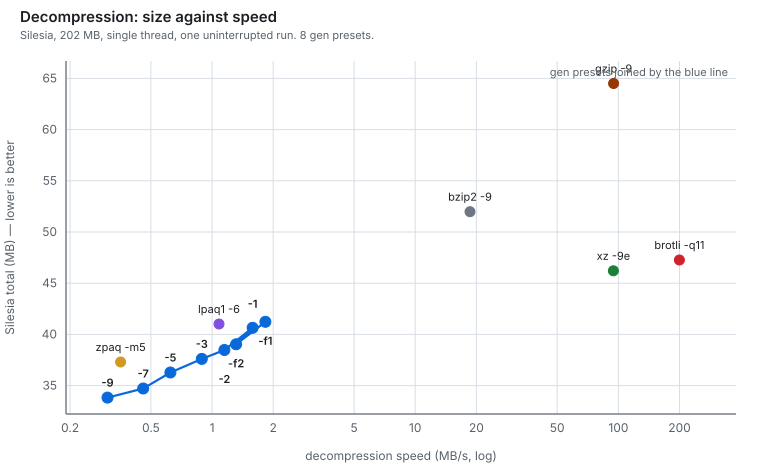

That asymmetry is the clearest statement of what this class of compressor is
for. On the decode axis the LZ family is not a competitor, it is a different
product: brotli finishes the corpus in 1.2 seconds against `-9`'s 722. Context
mixing is worth it when the data will be stored far more often than it is read,
or when the bytes saved are worth more than the seconds spent.

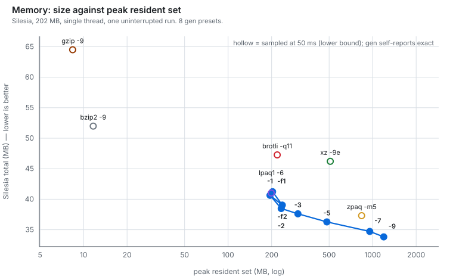

---

## Standard corpora

Silesia is one corpus. These are four more, so the picture does not rest on a
single file. Each is compressed as **one stream** — enwik8 and enwik9 are already
single files, Calgary and Canterbury are their canonical file sets concatenated
in order — so every codec sees identical bytes with no per-file container
overhead. For the two large single files this means the whole file in one
segment (`-s` set above the file size), which is how the reference codecs
compress them too; at the default 64 MB segment size `gleipnir` splits enwik8 into two
segments and enwik9 into sixteen, each restarting from a cold model, which costs
about 1.8% on enwik8 and 4.3% on enwik9. Every `gleipnir` row was measured here on the
released binary and round-trip verified against its SHA-256.

**The competitor provenance differs by corpus, and it matters.** For enwik8 and
enwik9 the non-`gleipnir` sizes are the published figures from Matt Mahoney's [Large
Text Compression Benchmark](http://mattmahoney.net/dc/text.html), measured on his
hardware. Read those as sizes, not as a speed comparison against these times. The
LTCB entries also use the tunings listed on that page, some of which — notably
`xz`'s 1 GiB dictionary — differ from a codec's defaults, so a plain invocation
will not reproduce them. For Calgary and Canterbury every row including the
competitors was measured on this machine and is directly comparable throughout.

### enwik8 — 100,000,000 bytes of Wikipedia text

| codec | size | bpc | comp | decomp | source |
|---|---|---|---|---|---|
| `cmix v21` | 14,623,723 | 1.170 | | | LTCB |
| `nncp v3.2` | 14,915,298 | 1.193 | | | LTCB |
| `paq8px_v206 -12L` | 15,849,084 | 1.268 | | | LTCB |
| `zpaq 6.42 -max` | 17,855,729 | 1.428 | | | LTCB |
| **`gleipnir -9`** | **18,810,676** | **1.505** | 347.1s | 324.4s | here |
| **`gleipnir -5`** | **19,660,660** | **1.573** | 179.6s | 181.7s | here |
| `lpaq1 -9` | 19,755,948 | 1.580 | | | LTCB |
| `xz -9e` (tuned) | 24,703,772 | 1.976 | | | LTCB |
| `brotli -q11` | 25,764,698 | 2.061 | | | LTCB |
| `bzip2 -9` | 29,008,736 | 2.321 | | | LTCB |
| `gzip -9` | 36,445,248 | 2.916 | | | LTCB |

`gleipnir -9` is 4.8% smaller than `lpaq1 -9` and beats every LZ codec by a wide
margin, while trailing `zpaq -max` by 5.3% and the heavy CM and neural engines by
more. The two `gleipnir` rows compress at 0.29 MB/s (`-9`) and 0.56 MB/s (`-5`),
decoding within a few percent of that. Text is where this engine is weakest
relative to the field — the full preset ladder and the reason are in [Where it
struggles](#where-it-struggles).

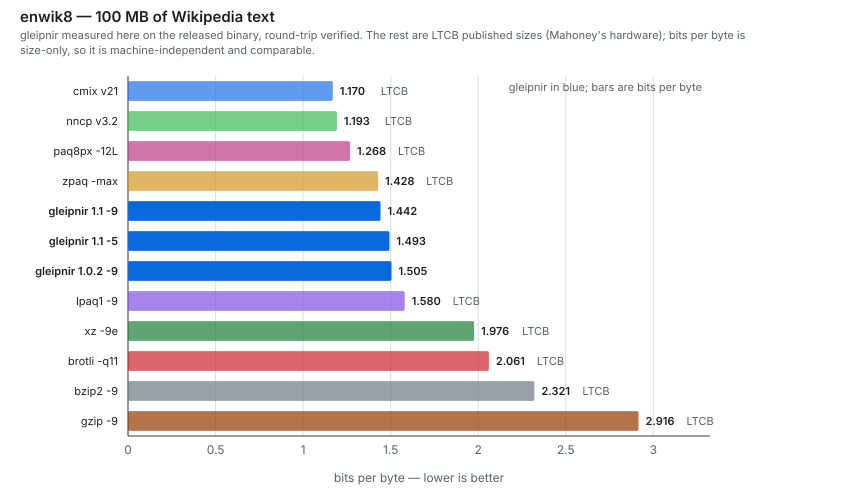

### enwik9 — 1,000,000,000 bytes

| codec | size | bpc | comp | decomp | source |
|---|---|---|---|---|---|
| `nncp v3.2` | 106,632,363 | 0.853 | | | LTCB |
| `cmix v21` | 107,963,380 | 0.864 | | | LTCB |
| `paq8px_v206 -12L` | 124,696,410 | 0.998 | | | LTCB |
| `zpaq 6.42 -max` | 142,252,605 | 1.138 | | | LTCB |
| **`gleipnir -9`** | **157,073,377** | **1.257** | 3186.3s | 3261.6s | here |
| `lpaq1 -9` | 164,508,919 | 1.316 | | | LTCB |
| **`gleipnir -5`** | **167,360,632** | **1.339** | 1620.0s | 1690.5s | here |
| `xz` (tuned) | 197,331,816 | 1.579 | | | LTCB |
| `brotli` | 223,597,884 | 1.789 | | | LTCB |
| `bzip2 -9` | 253,977,839 | 2.032 | | | LTCB |
| `gzip -9` | 322,591,995 | 2.581 | | | LTCB |

At the gigabyte scale `gleipnir -9` is 4.5% smaller than `lpaq1 -9` and beats every LZ
codec by a wide margin, while trailing `zpaq -max` by 10.4% and the dedicated text
engines by more, running at 0.31 MB/s where `-5` runs at 0.62. Its 157,073,377
would sit mid-table on the LTCB leaderboard, behind the CM and neural engines and
ahead of `lpaq1` and every LZ codec. Compressing the whole gigabyte in one
segment peaks at 3.0 GB, decoding at 3.8 GB; the default 64 MB segmentation holds
near 1 GB for about 4.3% more output.

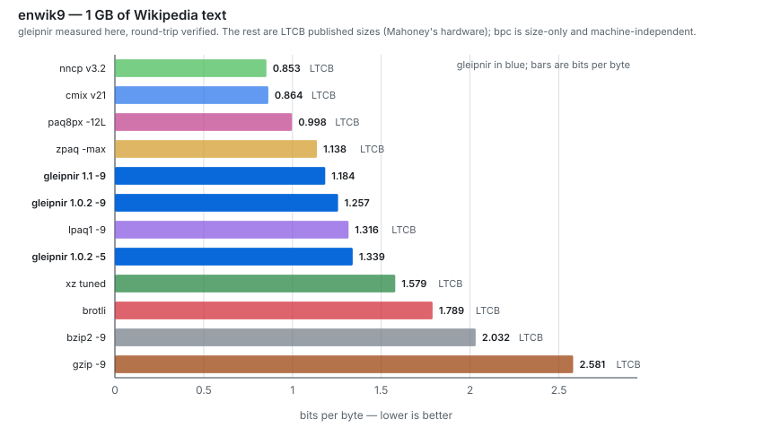

### Calgary — 3,141,622 bytes, fourteen files

| codec | size | bpc |
|---|---|---|
| `paq8px -8` | 560,705 | 1.428 |
| **`gleipnir -9`** | **651,967** | **1.660** |
| `zpaq -m5` | 659,513 | 1.679 |
| `gleipnir -7` | 661,432 | 1.684 |
| `lpaq1 -6` | 682,211 | 1.737 |
| `xz -9e` | 819,440 | 2.086 |
| `bzip2 -9` | 859,448 | 2.188 |
| `gzip -9` | 1,021,855 | 2.602 |

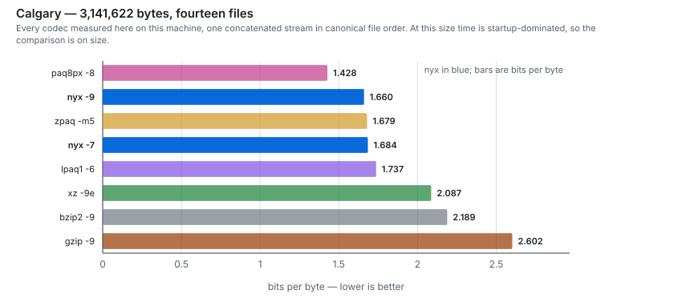

### Canterbury — 2,810,784 bytes, eleven files

| codec | size | bpc |
|---|---|---|
| `paq8px -8` | 302,791 | 0.862 |
| **`gleipnir -9`** | **355,766** | **1.013** |
| `gleipnir -7` | 359,844 | 1.024 |
| `zpaq -m5` | 362,880 | 1.033 |
| `lpaq1 -6` | 388,787 | 1.107 |
| `xz -9e` | 483,616 | 1.376 |
| `bzip2 -9` | 569,486 | 1.621 |
| `gzip -9` | 735,312 | 2.093 |

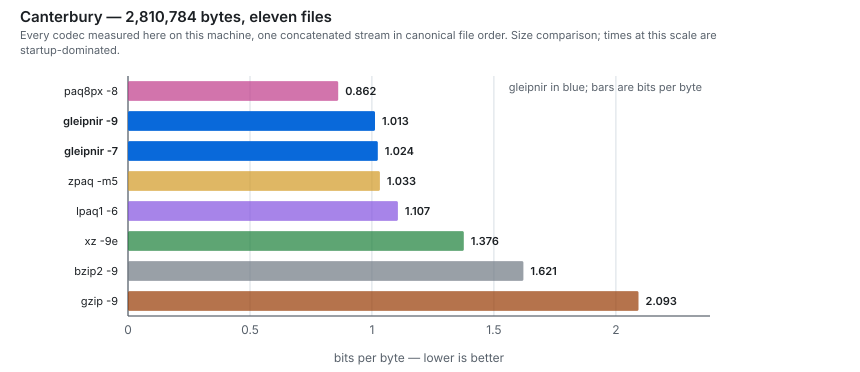

On both small corpora `gleipnir -9` lands ahead of `zpaq -m5` and behind `paq8px -8`,
the same order it holds on Silesia, and on Canterbury even `-7` passes `zpaq`.
Times at this scale are dominated by process startup, so these two lead on size.
The picture is consistent across all five corpora: `gleipnir` beats `zpaq -m5` on
general and structured data, edges `lpaq1` on text, and trails the engines that
spend far more time per bit.

---

## How speed is measured

Every timing in this document was produced the same way, and the method exists
because each rule below was learned by getting a wrong answer first.

**One job at a time.** Timings are taken with nothing else running. A concurrent
benchmark stealing cores once produced a phantom 8% regression that was chased
as a code bug. The harness never parallelises its own runs.

**Delete the output, then require a fresh one.** Freshly linked executables on
this machine are intermittently blocked by Device Guard / AV. A blocked run
leaves the *previous* run's output in place, so the harness reads a stale size
and a near-zero time. That produced a "660 ms" datapoint that was silently a
different build's result. Every runner now deletes the target first and retries
until a non-empty file appears, failing loudly after six attempts.

**Never benchmark on slices.** A 2 MB slice of a corpus systematically
understates context-mixing gains, because the models have not filled their
tables yet. The ISSE chain measured −0.67% on slices and **−2.07%** on the full
corpus. No decision in this project was made from a slice.

**Wall clock, not CPU time.** The engine reports CPU seconds in its status line;
the benchmark harness measures wall time around the whole process, including
start-up, I/O and model allocation, because that is what a caller pays.

**Peak RSS is asked for from inside the process.** `PeakWorkingSet64` read off an
exited process returns zero on this machine, and sampling from outside misses
the peak. `peak_rss()` calls `GetProcessMemoryInfo` on itself (or `getrusage` on
POSIX) and prints the result, so the memory figures are measurements rather than
the arithmetic estimates an earlier draft of this file used.

**A/B builds differ by one `-D`.** Ablations compile the same source with a
single define changed, so nothing else can drift. Editing the source while an
A/B is building is a way to get numbers from two different programs — check
build timestamps if in doubt.

**Profile-guided optimization measured as nothing** (+0.12% / −0.28%, output
byte-identical), and that null result is load-bearing: together with the memory
sweep (32× more memory for only 31% more time, because the per-nibble prefetch
overlaps the misses) it says this loop is bound by **dependent-load latency and
arithmetic** — not branches, not bandwidth. Which is why every optimisation that
has ever paid here removed work rather than doing the same work faster.

**Beware ablations that change more than they claim.** Disabling `rehash` for
seven bytes in eight measured as 22% of runtime, which read as "hashing is
expensive". It is not: converting the 20-deep `if/else` dispatch over `ORD[k]`
into a `switch` — same bodies, byte-identical output, a jump table instead of up
to 18 comparisons per context per byte — changed nothing (+0.24%, +0.65%,
−0.98% across three files, i.e. noise). Every context takes the same branch on
every byte, so the predictor is already perfect.

The ablation was confounded: skipping `rehash` also leaves the *previous* byte's
hashes in place, so `group_find` keeps hitting the same cache lines. Most of
that 22% was the cache effect of not moving, not the arithmetic of hashing. An
ablation that removes a computation usually also removes the memory traffic that
computation was feeding — attribute it to both, or design the ablation to hold
one of them fixed.

Measured shares of the bit path, after that correction: SSE stages 31%, ISSE
weight update 6.3%, StateMap update 2.4%, bit-history transition 0.3%, mixer
weight update ~0% (it vectorises into nothing). The remaining ~60% is
predict-side memory traffic — 30 StateMap reads per bit, 60 group lookups per
byte — which is not overhead, it is the algorithm. Reducing it means running
fewer contexts, which is exactly what the preset ladder exposes.

**Absolute times are not comparable across sessions.** The same binary producing
byte-identical output measured 959.2s in one session and 852.4s in another — an
11% spread from machine state alone (thermal, background OS work). Compressed
sizes are deterministic and *are* comparable; times are only comparable within
one uninterrupted run, which is why the preset table above is a single run
rather than assembled from the best figure for each row.

**Monotonicity is a free contamination detector.** Where a parameter has a known
monotone effect on time, check the measured times against it — a violation means
the measurement, not the code. In a bypass-gate sweep at `-9`, gates 400 and 800
measured **21.5% and 28.3% slower than disabling the bypass entirely**, which is
impossible: a higher gate strictly does less work than no gate does. That was
the first evidence that something else had started on the machine partway
through the sweep (it turned out to be a game launching, taking several cores
and 3.3 GB). Rule 1 above is only useful if it is *checked* rather than assumed,
and this is the cheapest way to check it after the fact.

The same signature appears inside a single corpus pass: times that degrade
monotonically with position in the run — xml −10%, mr +23%, osdb +64%, webster
+49%, mozilla +42% against an earlier clean run of the same presets — while the
compressed sizes stay put. **Sizes are deterministic and survive contamination
intact; only the clock is affected.** A sweep whose sizes look right and whose
times look strange has not partially failed, it has been descheduled, and every
timing in it must be thrown away rather than corrected.

---

## Verification

No change ships without both suites passing:

```bash
python scripts/fuzz.py gleipnir.exe --v2    # 81 edge cases x 8 presets = 648 round trips
python scripts/tfuzz.py gleipnir.exe --v2   # 10 cases x 6 thread counts = 60 round trips
```

708 round trips, every one byte-exact. The level sweep in `scripts/fuzz.py` is not
redundant with a single level: each preset is a different context set, ISSE
depth, SSE stage count and match-bypass gate, so a preset can have a container
or state bug the others do not.

`scripts/fuzz.py` covers empty and near-empty files, single-symbol files, alphabet sizes
either side of the packing threshold, MZ headers too short to filter, zlib at
every level and memLevel, strategies deliberately *not* searched (must fall back,
not corrupt), raw deflate, gzip, truncated and corrupted streams, nested zlib, a
real ZIP, and incompressible input at every level.

`scripts/tfuzz.py` decodes every archive at a **different** `-t` than it was encoded
with, and includes sizes exactly at and either side of the 1 MB chunk boundary.

Support tools:

| file | purpose |
|---|---|
| `scripts/readblk.py` | parses the block table straight out of a container — ground truth, no instrumentation to get wrong |
| `scripts/t_alpha.c`, `scripts/t_seg.c` | exercise the Alpha detector and the segmenter in isolation |
| `scripts/cmp_gen.py` | A/B two builds on slices |
| `scripts/full_ab.py` | A/B on full Silesia with zpaq's per-file numbers inline |
| `scripts/final_bench.py` | full corpus run with round-trip verification |
| `scripts/bench_final.py` | all presets: size, both directions, RSS, hash check |
| `scripts/make_mixed.py` | generate the 13-file mixed-type corpus (fixed seed) |
| `scripts/bench_mixed.py` | mixed corpus vs zpaq / xz / lpaq1 |
| `scripts/bench_refs.ps1` | reference codecs: size, both directions, sampled peak RSS |
| `scripts/byt_sweep.py` | match-bypass gate sweep across files that disagree |
| `scripts/t2_sweep.py` | sweep any compile-time gate across the six files that disagree |
| `scripts/ident_check.py` | prove two builds are byte-identical per file and preset |
| `scripts/ab_corpus.py` | before/after on the full corpus, interleaved in one session |
| `scripts/f_ablate.py` | remove one table at a time to locate where the time goes |
| `scripts/fshape.py` | pick a preset's table shape on the size-vs-time frontier |
| `scripts/ht_test.py` | SMT pairing: is the loop latency-bound or resource-bound? |
| `scripts/ab_speedup.py` | same-session A/B of two builds on the same files |
| `scripts/e8.py`, `scripts/e8_refs.py` | enwik8 preset ladder and its reference rows |
| `scripts/mkgraphs.py` | the graphs in this file, as dependency-free SVG |
| `scripts/bench_session.py` | **every preset and every reference codec in one interleaved session**, with drift sentinels at both ends — the harness behind the preset table above; writes `bench_session.json` |
| `scripts/parse_bench_log.py` | rebuild `bench_final.json` from an interrupted sweep's log |
| `scripts/t_period.c` | MAD curve per stride — ground truth for the record model |
| `scripts/t_adiv.c` | opcode-diversity distributions — ground truth for Alpha detection |
| `scripts/sweep.py` | rebuild across a `-D` parameter grid |

The two `t_*.c` probes exist because both detectors were fixed the same way:
replicate the decision in isolation, dump the distribution it is deciding on,
and pick thresholds from that. Both times, thresholds chosen by intuition were
wrong in a way that only showed up as a ratio loss on one file.

---

## Where it struggles

Honest failure modes, each with what was done about it and what is still open.

### Fixed

**The mid presets were strictly dominated by lpaq1.** The old `-5` produced
20,553,653 on enwik8 in 236s where lpaq1 produced 20,078,550 in 92s — smaller
*and* 2.6× faster, which is simply a loss. The cause was the context set: `-5`
carried the two record contexts, which are inert unless a period is detected,
and carried neither the word-pair nor the line model, the two things that
actually pay on text. Rebuilt around orders 1–6 plus word, word-pair, line,
previous-line, indirect and one sparse.

enwik8, single thread, released binary, all `gleipnir` rows round-trip verified. The
`gleipnir` ladder and the two reference codecs were each run as an uninterrupted pass
on the same idle machine (not interleaved with drift sentinels the way the
Silesia table is, so read the times as same-machine rather than same-session):

| | output | bpc | comp | decomp |
|---|---|---|---|---|
| `-1` | 23,263,174 | 1.861 | 72.3s | 74.5s |
| `-3` | 20,125,007 | 1.610 | 144.5s | 133.4s |
| `-5` | 19,660,660 | 1.573 | 179.6s | 181.7s |
| `-7` | 19,088,707 | 1.527 | 239.9s | 243.5s |
| `-9` | 18,810,676 | 1.505 | 347.1s | 324.4s |
| lpaq1 -6 | 20,078,550 | 1.606 | 87.0s | 93.1s |
| zpaq -m5 | 19,625,046 | 1.570 | 297.8s | 298.3s |

The old strict domination is gone: `-5` is now **2.08% smaller than lpaq1**
where the pre-rebuild `-5` was 2.4% larger. But **lpaq1 is still ahead at
comparable ratio** — it is 0.23% smaller than `-3` *and* faster (87.0s against
144.5s), reaching output between `-3` and `-5` in half of `-5`'s time. It
dominates `-3` outright and sits on this engine's size-time frontier just below
`-5`, which is a fair summary of where text modelling here still falls short.

Against `zpaq -m5` on enwik8, only `-7` and `-9` win on size: `-5` is 0.18%
*larger* (though 1.7× faster), `-7` is 2.73% smaller and still 1.2× faster, `-9`
is 4.15% smaller at 1.2× the time. This is a much thinner margin than the −9.03%
on Silesia, and that contrast is the point: **the Silesia advantage comes from
structured and binary content, not from text.**

`-7` is the preset where the match bypass earns least on this file. enwik8 is a
single 100 MB stream of prose whose matches are mostly medium-length, which is
precisely the distribution the gate sweep showed to be expensive, and `-7`'s
gate of 128 sits closest to that cliff. On Silesia, where `-7` sees archives and
binaries, the same gate is a ratio win. A gate that is correct on a mixed corpus
is not automatically correct on a homogeneous one.

**Stride detection was wrong on every file that depended on it.** It picked
harmonics (56 where the record is 28), missed 1024-byte rows entirely, and on a
file with no period at all changed its mind 18,944 times. Replaced with a direct
mean-absolute-difference measurement with harmonic reduction and a rejection
gate. Details in the record-model notes above.

**16-bit rasters were modelled as byte streams.** The byte at −1 is the other
half of the current sample and predicts almost nothing. Element width is now
detected and the neighbourhood contexts step back one *sample*.

**Six of thirty context tables ran at 2^10 groups.** A `GBITS[]`/`ORD[]` length
mismatch left the last six contexts taking their size from zeroed globals. They
looked worthless in ablations when they were merely starved. Now guarded by a
`_Static_assert` per level.

### Open

**Text is the weakest content type relative to the field.** On enwik8 this
engine is +20.9% against `paq8px -12L` and +31.0% against `cmix v21`. More
telling, `durilca'kingsize` reaches 16,209,219 — 15% *below* this engine — while
running about 4× faster, on a slower CPU. It does that with dictionary
preprocessing, not with better modelling. **A text preprocessor is the single
largest opportunity left, and it is a transform, not a model.** Not attempted
here.

**Container formats are the largest absolute gap.** mozilla, samba, ooffice and
nci account for the bulk of the distance to the record. paq8px has a dozen
content detectors and real recompressors; this has three transforms. The gap is
a detection and transform problem, not a mixing problem — the same corpus shows
this engine within 3.1% of the record on x-ray and 3.6% on sao, where content is
uniform and detection is easy.

**Threading costs ratio, and cannot not.** Chunks are compressed independently
so they can be decoded in parallel, which means every chunk starts with a cold
model. See the threading table for the measured curve. There is no fix that
preserves parallel decode; priming chunk *k* from chunk *k−1* would serialise
decompression. The same restart applies to segments on a single thread: at the
default 64 MB segment size a larger file is split and each segment starts cold, so
the single-thread enwik8 and enwik9 figures above still pay it. Compressing the
whole file as one segment — `-s` set above the file size — removes the restart,
worth about 1.8% on enwik8 and 4.3% on enwik9, at the cost of buffering the entire
input (below).

**The whole input is buffered in RAM.** `readfile` reads the entire file and the
match model indexes absolute positions into it. For a 1 GB input that is ~1 GB
plus tables plus a 1.25 GB output buffer. Fine within a 10 GB budget, fatal in a
container with a 512 MB limit regardless of `-m`. Streaming would require
windowing the match model — not attempted.

**There is a hard memory floor `-m` cannot reach past.** The match index and the
mixer weights do not scale with `-m`. `-1` on a 10 MB file now sits at 38 MB,
down from 79 — about half that floor turned out to be APM tables being allocated
for stages the preset never evaluates, which is fixed. What is left is a 2^18–2^22
match index, 6.3 MB of mixer weights, and the input buffer. Single-digit-MB
operation would still need the match index and mixer rebuilt to scale.

**Detection is scoped to these corpora.** No JPEG, audio, UTF-16 or base64
detector exists. Nothing in Silesia or enwik needs them; a general-purpose
deployment would.

---

## Where this stands

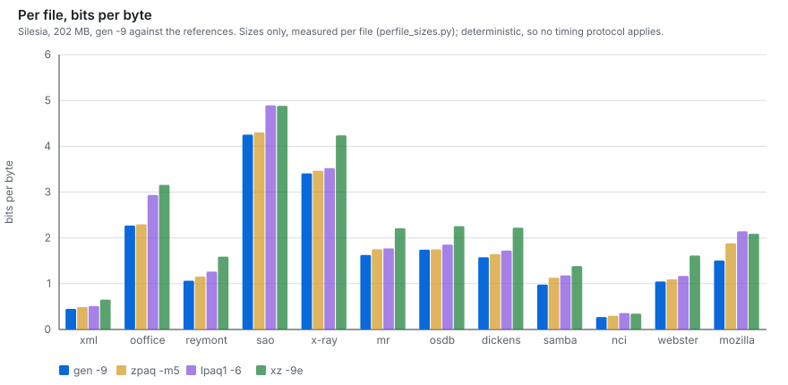

Per file against `zpaq -m5` and against the published Silesia record
(`paq8px_v215 -12L`, 29 GB):

| file | gleipnir -9 | zpaq -m5 | vs zpaq | record | vs record |
|---|---|---|---|---|---|
| xml | 311,357 | 326,987 | −4.8% | 245,000 | +27.1% |
| ooffice | 1,749,356 | 1,766,594 | −1.0% | 1,212,000 | +44.3% |
| reymont | 883,678 | 956,543 | −7.6% | 699,000 | +26.4% |
| sao | 3,856,927 | 3,899,298 | −1.1% | 3,723,000 | +3.6% |
| x-ray | 3,612,587 | 3,669,743 | −1.6% | 3,503,000 | +3.1% |
| mr | 2,028,749 | 2,181,349 | −7.0% | 1,750,000 | +15.9% |
| osdb | 2,203,445 | 2,204,782 | −0.1% | 1,969,000 | +11.9% |
| dickens | 2,051,952 | 2,094,787 | −2.0% | 1,860,000 | +10.3% |
| samba | 2,662,288 | 3,053,862 | −12.8% | 1,587,000 | +67.8% |
| nci | 1,144,439 | 1,251,149 | −8.5% | 776,000 | +47.5% |
| webster | 5,523,469 | 5,666,876 | −2.5% | 4,401,000 | +25.5% |
| mozilla | 9,745,710 | 12,041,099 | −19.1% | 6,094,000 | +59.9% |

x-ray is no longer the one file behind zpaq; the raster models moved it from
+0.4% to −1.6%, and mr from −0.1% to −7.0%. Every file is now ahead of
`zpaq -m5`.

Measured directly against paq8px at comparable memory (`-6`, ~830 MB):

| | paq8px -6 | gleipnir -9 | gap | paq8px time |
|---|---|---|---|---|
| dickens | 1,927,665 | 2,051,952 | +6.4% | 1,639s vs 37s |
| samba | 1,661,309 | 2,662,288 | +60.2% | 3,392s vs 74s |
| mozilla | 6,602,264 | 9,745,710 | +47.6% | 13,266s vs 221s |

paq8px is decisively smaller and **44–60× slower** on the same machine, at 2.7×
the memory on mozilla. The paq8px column was measured in an earlier session and
its sizes are deterministic, so the comparison holds; only its *times* are from
a different session than gleipnir's, and at a 44× gap that does not change anything.

The remaining gap is **concentrated, not spread**. mozilla, samba, ooffice and
nci account for the bulk of it, and all four are containers holding
heterogeneous embedded content. On homogeneous data this compressor is close
(sao +4.7%, x-ray +5.2%, dickens +10.4%). What is missing is paq8px's content
detection and transformation layer — identifying embedded executables, images,
base64 and text *inside* a container and routing each to a specialised model.
This project has four block kinds on 8 KB windows; paq8px has dozens of
detectors and ~50 models.

---

## Gotchas worth recording

**Do not name a macro `BTYPE`.** `winnt.h` defines `BTYPE(x)` as
`((x) & N_BTMASK)` for COFF symbol types, and `<windows.h>` is included partway
down this file for the thread API. From that point on the Windows macro silently
won, so every block-kind test after the include matched only kind 3 — Alpha at
alignment 0 — and the transform never ran on the other three alignments.
`segment()` sits *above* the include and so behaved correctly, which is why the
block table looked perfect while the model saw almost no code at all. Cost:
about an hour chasing a nonexistent alignment bug. `gcc -E` answers this kind of
question in seconds; printf debugging does not, because the instrumentation
inherits the same broken macro.

**Slice benchmarks understate context-mixing gains, badly.** Adaptive stages
(ISSE weights, StateMaps, mixer weights, the match index) spend a fixed warm-up
cost that a 2 MB file never amortises, and high-order contexts never accumulate
enough observations to beat low-order ones. The ISSE chain scored −0.67% on
slices and −2.07% on the full corpus; the SSE retune scored −0.24% on slices and
−2.4% on full webster. It runs the other way too: an early build showed a 9.2%
lead over zpaq on slices that became a 1.6% *deficit* at full size. Use slices
only for fast relative sweeps of a single scalar; confirm every accept/reject
decision on full files.

One more, related: any parameter tuned while a feature is silently broken is
tuned wrong. The Alpha detection thresholds were swept to a loose setting
because false positives were harmless while the macro collision suppressed the
transform; they had to be re-swept once it worked.

**Never time a build while another job holds the cores, and never compare
timings across sessions.** The clearest measured instance: one binary producing
byte-identical output on the full corpus took **959.2s** in one session and
**852.4s** in another — an 11% spread with zero code difference. Earlier in this
project a concurrent benchmark stealing cores produced an apparent 8% regression
that was chased as a code bug and did not exist.

Size measurements are deterministic and safe to run concurrently; timings are
not. Compare builds alternating A-B-A-B in one foreground command on an idle
machine, and never assemble a comparison table from runs taken minutes or hours
apart — which is why every multi-row timing table in this file comes from a
single uninterrupted run.

**A periodicity detector must prefer the fundamental and be allowed to say
"none".** Every multiple of a true period recurs just as reliably as the period
itself, so any "which gap repeats most" heuristic drifts to a harmonic — sao's
MAD minima at 28, 56, 84, 112, 140, 196 and 252 are all within 2% of each other,
and the old detector picked 56. Two fixes, both necessary: walk *down* to the
smallest candidate within a few percent of the best, and gate on beating stride 1
so a file with no period reports none instead of thrashing between spurious
values. Before this, on ooffice the stride changed 18,944 times.

---

## Repository layout

`gleipnir.c` is the whole compressor and archiver. Everything else is the tooling
that produced the numbers in this file, kept under `scripts/` so every claim has
a script behind it rather than a screenshot. Each runs from the repo root
(`python scripts/<name>`). Grouped by what it does:

**Correctness gates**
- `scripts/fuzz.py` — round-trip over the edge cases that break container formats
- `scripts/tfuzz.py` — round-trip across thread counts, where chunking changes the layout
- `scripts/gfuzz.py` — randomised corruption fuzzer for the archive format
- `scripts/ident_check.py` — byte-identity check between two builds, per file and preset

**Benchmarks**
- `scripts/bench_session.py` — every preset and every reference codec in one session (the Silesia table)
- `scripts/bench_final.py`, `scripts/final_bench.py` — full-size Silesia runs, one and eight threads
- `scripts/bench_mixed.py` — the mixed-type corpus against the reference codecs
- `scripts/e8.py`, `scripts/e8_refs.py` — enwik8 across presets, and its zpaq/lpaq1 reference rows
- `scripts/parse_bench_log.py` — rebuild `bench_final.json` from a run log

**A/B and ablation**
- `scripts/ab_corpus.py`, `scripts/full_ab.py`, `scripts/cmp_gen.py` — before/after between two builds at corpus, full-Silesia and slice scope
- `scripts/ab_speedup.py`, `scripts/f_ablate.py`, `scripts/ht_test.py` — where specific speed changes and the `-f1` time actually go

**Parameter sweeps**
- `scripts/sweep.py` — rebuild across a parameter grid and report size
- `scripts/t2_sweep.py`, `scripts/byt_sweep.py` — sweep one gate across files that disagree
- `scripts/fshape.py` — pick the shape of the `-f` presets on the size-vs-time frontier

**Corpus and graphs**
- `scripts/make_mixed.py` — build a diverse corpus of types Silesia does not contain
- `scripts/mkgraphs.py` — generate the benchmark graphs as dependency-free SVG

**Low-level probes**
- `scripts/readblk.py` — parse the block table straight out of a container
- `scripts/t_period.c` — ground-truth periodicity by full mean-absolute-difference
- `scripts/t_adiv.c`, `scripts/t_alpha.c`, `scripts/t_seg.c` — opcode-diversity, Alpha and segment-model probes

Build and packaging live in `build.sh`, `Makefile`, `packaging/` and `dist/`.
The deep design notes are in [ARCHITECTURE.md](ARCHITECTURE.md); day-to-day use
is in [USAGE.md](USAGE.md).

---

## Licence

**GNU General Public License v3.0 or later** — full text in
[LICENSE.md](LICENSE.md).

Gleipnir is free software. There is nothing to pay, no thresholds to check, and no
distinction between production and any other use.

- **Run it** for any purpose, including commercially and in production, at any
  scale, without asking anyone.
- **Study and modify** the source.
- **Redistribute** copies, modified or not, and charge for doing so.

The one obligation is copyleft, and it only applies if you *distribute* Gleipnir or
something built from it: whoever receives it must get the same freedoms, which
means offering them the corresponding source under the GPL, keeping the
copyright and licence notices intact, and marking what you changed. Running Gleipnir
inside your own organisation, however large, is not distribution and triggers
none of this.

I retain the copyright, so a separate licence can be granted where the GPL does
not fit — embedding Gleipnir in a product shipped under other terms, or wanting a
warranty, indemnity or support commitment. See [COMMERCIAL.md](COMMERCIAL.md).
Ordinary use never needs it.

### Licence history

Gleipnir 1.0.0 was first published under the Business Source License 1.1 with a
Change Date of 2030-08-04, on which it would have converted to
GPL-3.0-or-later. That conversion has been brought forward. Gleipnir is
GPL-3.0-or-later as of now, the BSL terms no longer apply to any version, and
describing Gleipnir as open source is accurate — GPL-3.0 is OSI-approved.

zlib is linked for DEFLATE recovery under its own permissive licence,
reproduced in full in `dist/LICENSE.txt`. It is GPL-compatible and places no
restriction on the terms Gleipnir itself is offered under.
